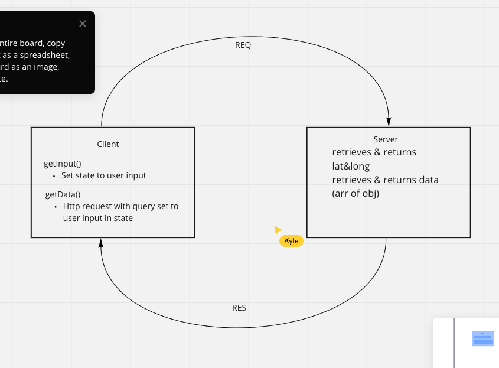
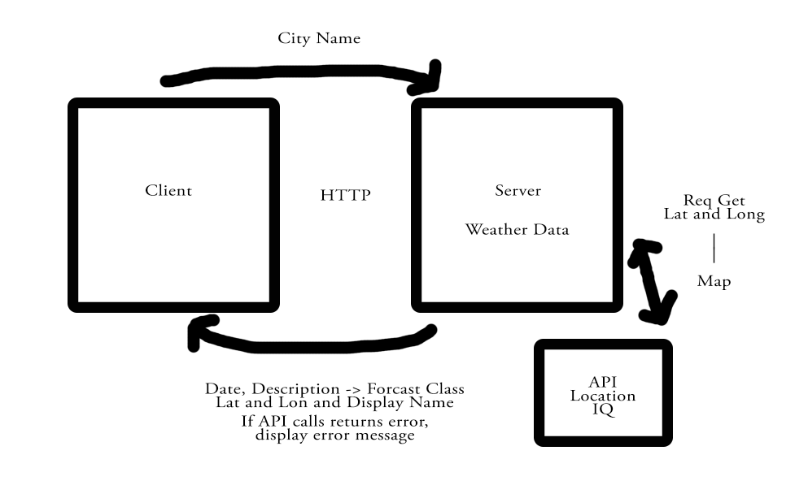
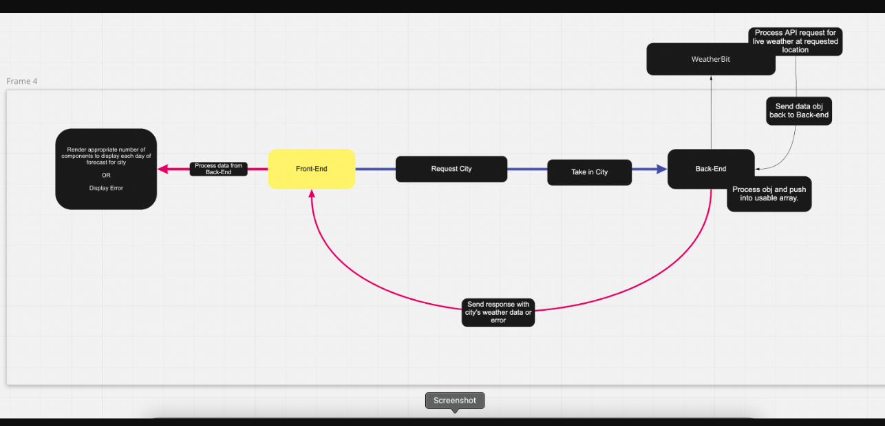
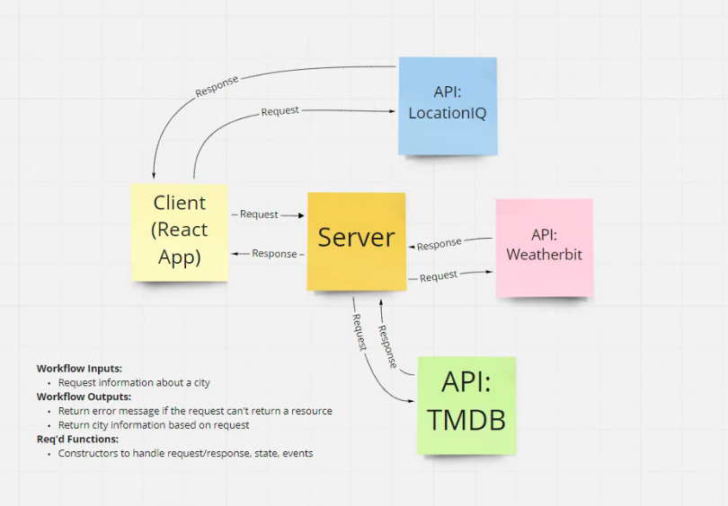

# LAB - 06-10

## Version: 1.2.0

## Overview:

## Getting Started

## Architecture

## City Explorer

### Author: Antoine Charette

### Links and Resources

- [submission PR](http://xyz.com)
- Any Links you used as reference

### Reflections and Comments

- Consider including the answers to your daily journal and submission questions here
- This is also a good place to reflect on the tools and resources used and learned

## Lab 06 - WRRC

### Time Estimates

#### Name of feature: Form

Estimate of time needed to complete: 1 hour

Start time: 6 pm

Finish time: 6:45 pm

Actual time needed to complete: 45min

#### Name of feature: Map

Estimate of time needed to complete: 1 hour

Start time: 6:45 pm

Finish time: 7:30 pm

Actual time needed to complete: 45min

#### Name of feature: Error handling

Estimate of time needed to complete: 1 hour

Start time: 8:30 pm

Finish time: 9:00 pm

Actual time needed to complete: 30min

## Lab 07 - Request/Response Cycle

### Times Estimates

Name of feature: Weather section

Estimate of time needed to complete: 30 mins

Start time: 12 am

Finish time: 12:30 am

Actual time needed to complete: 30 mins

## Lab 08

### Time Estimates

Name of feature: Movie Component

Estimate of time needed to complete: 30 mins

Start time: 10 pm

Finish time: 10:30 pm

Actual time needed to complete: 30 mins

## Lab 09

### Time Estimates

Name of feature: Lab 9

Estimate of time needed to complete: 1 hour

Start time: 2:45 pm

Finish time: 4 pm

Actual time needed to complete: 1 hour 15 mins
